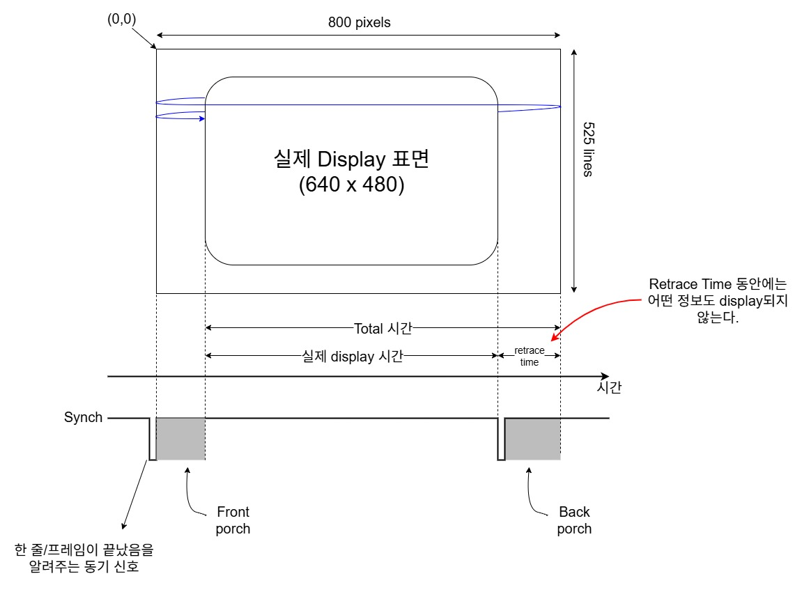
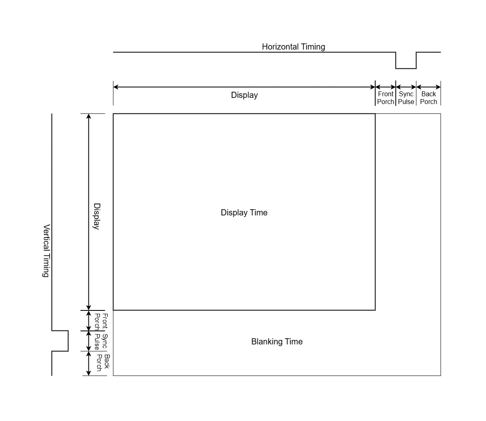
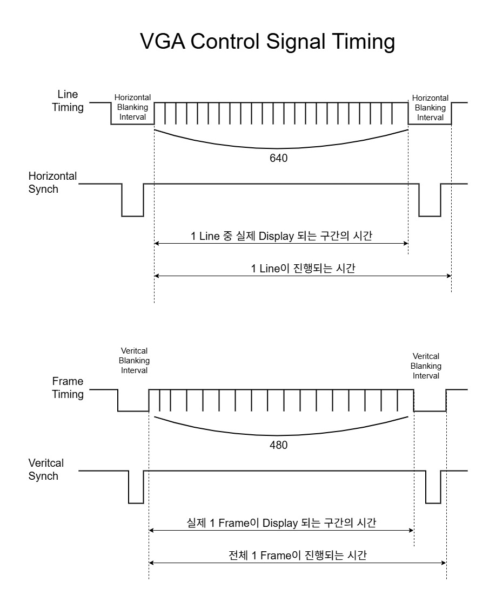

# VGA 
##  Video Graphics Array 
 - 비디토 출력 장치를 연결하는 표준 인터페이스
 - CRT의 주사 개념을 이용한 그래픽 표현 방식
 - 실제 표시되는 해상도 영역보다 더 큰 구역에 Porch 구간(Display 하지 않는 구간)을 두어 한 line 끝에서 왼쪽으로, 한 frame 끝에서 다시 맨 위로 되돌아오는 동안 화면이 안나오게 함    --> 화면을 안정화시키고 기준을 잡기 용이         

 
-----------------------------
---------------------------------
 - Sync의 위치를 조절함에 따라 Display의 위치를 조정할 수 있다.
  

 - 해상도: 640 x 480, 주사율: 60Hz 기준 Signal Timing
 
 - Synch : 1Line 또는 1Frame이 끝났음을 알리는 신호 -> retrace 시작
 - Blanking Interval : retrace 시간동안 display하지 않는 시간

----------------------------------------------------------------

 

(컬러바 실습)

(필터링 실습)

(저장된 사진ROM 출력 실습)

(gray scaling)

---------------------------------------
# BMP
- 비트맵 디지털 그림을 저장하는 데 쓰이는 그림 파일 포맷

## BMP의 헤더 구조(핵심 데이터만 표기)
| 오프셋(16진수) | 크기(바이트) | 설명 |
|--------|---------|----------|
|   BMP 헤더    |
|02|2|BMP 파일 크기(54bye 헤더 + 16byte 데이터)|
|0A|4|비트맵 데이터를 찾을 수 있는 오프셋|
|   DIB 헤더    |
|12|4|비트맵의 너비(픽셀 단위)|
|16|4|비트맵의 높이(픽셀 단위)|
|1C|2|픽셀당 비트 수|